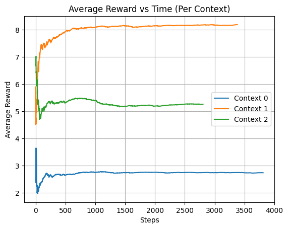
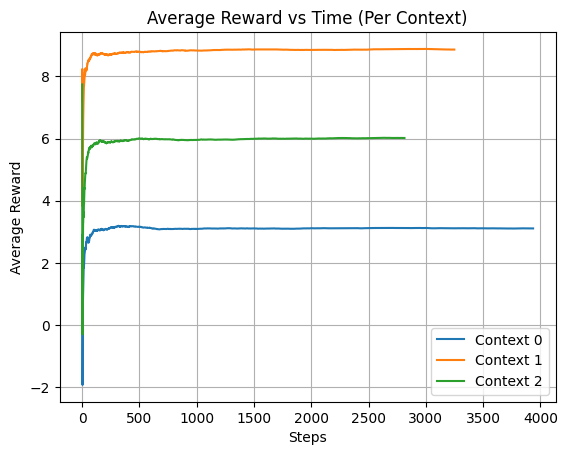
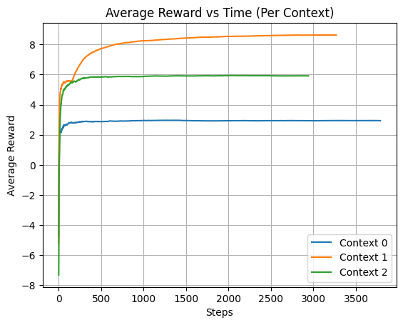
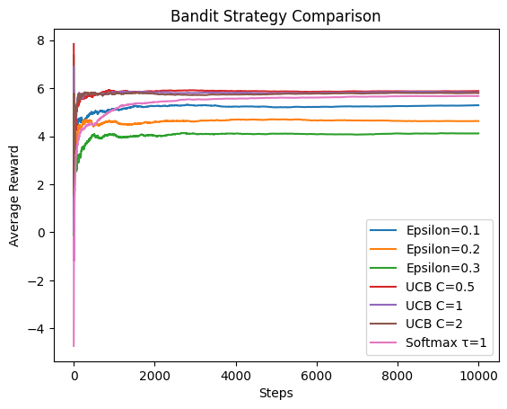
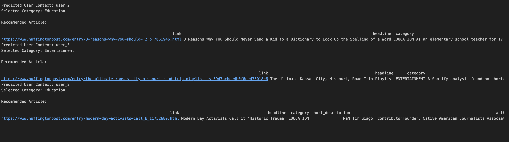

# Contextual Bandit – User Classification and News Recommendation

## Overview
This python implementation of a **contextual bandit based system for recommendations** preducts user context and learns to recommend the appropriate news category to a user through reinforcement learning techniques

In this pipeline we perform the following steps:

1. Data loading, then preprocessing
2. Encoding of features
3. Classification and context learning
4. Mapping context to the arms
5. Bandit learns using multiple strategies
6. Evaluation and comparison of strategies
7. Recommendation of news articles

This simulates real-world scenarios where user behavior and demographic features are used to personalize content recommendation.

---

# System Architecture

The system follows this pipeline:

```
User Dataset
     ↓
Preprocessing & Feature Engineering
     ↓
Context Classifier
     ↓
Context → Arm Mapping
     ↓
Bandit Algorithm (ε-Greedy / UCB / Softmax)
     ↓
Reward Simulation
     ↓
Recommendation Engine
```

---

# Project Structure

```
lab3-contextual-bandit/
│
├── data/
│   ├── train_users.csv
│   ├── test_users.csv
│   ├── news_articles_updated.csv
│
├── lab3_results_U20230039.ipynb
├── README.md
└── requirements.txt
```

---

# Installation

Install dependencies:

```bash
pip install pandas numpy matplotlib scikit-learn rlcmab-sampler
```

---

# Dataset Description

The dataset contains user context features including:

* Age
* Income
* Click behavior
* Purchase amount
* Session duration
* Engagement score
* Transactions
* Device and network features
* Region and subscription information

Each row represents a user with a labeled context category.

---

# Data Preprocessing

The preprocessing pipeline performs:

### Label Normalization

All labels are converted to lowercase to maintain consistency.

### Missing Value Handling

Missing values are filled using forward fill.

### Encoding

Categorical columns are encoded using LabelEncoder.

### Feature Binning

Continuous features such as:

* income
* clicks
* purchase amount
* age

are discretized to stabilize learning.

# Context Classification

A supervised learning model is trained to classify users into context categories.

Models explored:

* Decision Tree
* Logistic Regression (optional alternative)

The final configuration uses a Decision Tree classifier with controlled depth to prevent overfitting.

---

# Training Output
Our final output:

```
Train Accuracy: 92.87%
Validation Accuracy: 85%
```
---

# Context to Arm Mapping

Each predicted context is mapped to an action space representing news categories.

Our mapping:

```
user_1 → Context 0
user_2 → Context 1
user_3 → Context 2
```

Each context contains 4 possible actions (arms) as follows -
```
Entertainment → 0
Education → 1
Tech → 2
Crime → 3
```
---

# Bandit Algorithms Implemented

Three exploration strategies are implemented.

---

## 1. Epsilon-Greedy

Chooses:

* Random arm with probability ε
* Best arm otherwise

Used to balance exploration and exploitation.

---

## 2. Upper Confidence Bound (UCB)

Chooses actions using:

```
Q(a) + C * sqrt(log(t) / N(a))
```

Encourages exploration of uncertain arms.

---

## 3. Softmax Exploration

Chooses actions probabilistically:

```
P(a) = exp(Q(a)/τ) / Σ exp(Q(i)/τ)
```

Allows smoother exploration behavior.

---

# Reward Simulation

Rewards are generated using a synthetic reward sampler.

The system tracks:

* Rewards over time
* Average reward per context
* Estimated Q-values

---

# Screenshot: Average Reward Plot (Epsilon-Greedy)



---

# Screenshot: Average Reward Plot (UCB)



---

# Screenshot: Average Reward Plot (Softmax)



---

# Strategy Comparison

A final comparison plot shows average reward for all strategies.

---

# Screenshot: Strategy Comparison Plot



---

# Recommendation Engine

After training:

1. A user is sampled
2. Context is predicted
3. Best arm is selected
4. A news article is recommended

---

# Screenshot: Recommendation Output



---

# Results and Observations

Key findings:

* Classifier achieves strong validation accuracy
* Bandit algorithms converge over time
* UCB typically converges faster
* Softmax produces smoother reward curves

---

# Limitations

* Synthetic rewards rather than real user feedback
* Offline simulation instead of online learning
* Limited feature engineering

---

# Future Improvements

Possible enhancements:

* Neural contextual bandits
* Real-time recommendation pipeline
* Deep learning models
* Larger article datasets
* Personalization using embeddings

---
